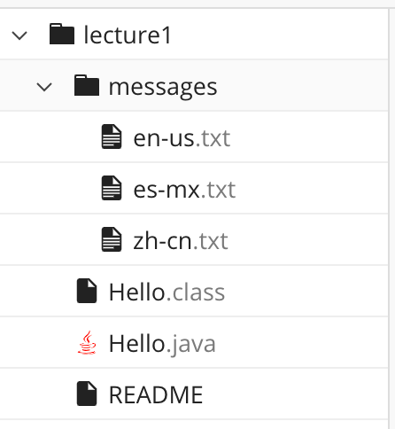

# Lab Report 1 - Remote Access and FileSystem

**`cd`** change directory \
**`ls`** list files \
**`cat`** view (or create) file \
<br>
> ***files and directories used in this lab report***



<br>

***


**1. an example of using `cd`, `ls`, `cat` with no arguments.**
* cd
  ```
  [user@sahara ~]$ pwd
  /home
  [user@sahara ~]$ cd
  [user@sahara ~]$ pwd
  /home
  ``` 
  As shown by the `~` sign and `pwd` command, *the initial working directory is `/home` for this and all other examples for question 1.* The command `cd` changes the working directory to an argument; however, there is no change in this situation because no arguments(/directories) are provided to access. Hence, as illustrated by the execution of the second `pwd` command, the present working directory is still `/home` after running the code. - This is not an error.
  <br>
  If the present working directory was not the home directory, `lecture1` and `messages` for instance:
  ```
  [user@sahara ~/lecture1]$ cd
  [user@sahara ~]$ pwd
  /home
  ```
  ```
  [user@sahara ~/messages]$ cd
  [user@sahara ~]$ pwd
  /home
  ```
  Having the `cd` command without any arguments will always bring us back to the home directory. - This is not an error.

<br>
  
* ls
  ```
  [user@sahara ~]$ ls
  lecture1
  ```
  The command `ls` displays all the directories and files in the working directory. Since the present working directory is `/home`, terminal returns the directories (and files) in the `/home` directory, `lecture1`, which you can also confirm from the image above. - This is not an error.

<br>
  
* cat
  ```
  [user@sahara ~]$ cat
  
  read me
  read me
  ```
  The command `cat` views the file. However, without argument, the user does not provide directions for which file to read. Thus, `cat` does not return anything until the user gives a command (or argument). For example, terminal echoed my text input `read me`. - This is not an error.

  <br>

**2. an exmaple of using `cd`, `ls`, `cat` with a path to a *directory* as an argument.**
* cd
  ```
  [user@sahara ~]$ pwd
  /home
  [user@sahara ~]$ cd lecture1/
  [user@sahara ~/lecture1]$ pwd
  /home/lecture1
  ```
  Again, as demonstrated by the first `pwd` command and `~` sign, *the current directory for this and all other examples for question 2 is `/home`.* By running the `cd` command with the path to `lecture1`, a directory as an argument, the command changes the present working directory to `/home/lecture1`, shown by the second `pwd`. - This is not an error.

  <br>

* ls
  ```
  [user@sahara ~]$ ls lecture1/
  Hello.class  Hello.java  messages  README
  ```
  By using `ls` with the path to `lecture1` as an argument, the command lists all the files and directories in the directory `lecture1`. It is noticeable in the actual code that `messages` is printed in blue with bold to separate it, a directory, from the other files. - This is not an error.
  
  <br> 
  
* cat
  ```
  [user@sahara ~]$ cat lecture1/
  cat: lecture1/: Is a directory
  ```
  The command `cat` is typically used to view files. So, having a directory, `lecture1`, as a path throws an error message: `cat: lecture1\: Is a directory`. - This is not an error.

  <br>
  
**3.  an example of using `cd`, `ls`, `cat` with a path to a *file* as an argument.**
* cd
  ```
  [user@sahara ~/lecture1]$ cd Hello.java
  bash: cd: Hello.java: Not a directory
  ```
  *The present working directory for all examples in question 3 is `/home/lecture1`, as shown by the `~/lecture1` sign.* Command `cd` changes the working directory; therefore, setting the path to a file `Hello.java` throws an error message: `bash: cd: Hello.java: Not a directory`. - This is not an error.

  <br>
  
* ls
  ```
  [user@sahara ~/lecture1]$ ls Hello.java
  Hello.java
  ```
  The only file present in the path to the file `Hello.java` is `Hello.java`, hence the command `ls` returns `Hello.java`. - This is not an error.

  <br>
  
* cat
  ```
  [user@sahara ~/lecture1]$ cat Hello.java
  import java.io.IOException;
  import java.nio.charset.StandardCharsets;
  import java.nio.file.Files;
  import java.nio.file.Path;

  public class Hello {
    public static void main(String[] args) throws IOException {
      String content = Files.readString(Path.of(args[0]), StandardCharsets.UTF_8);    
      System.out.println(content);
    }
  }
  ```
  The command `cat` is used to view files. Thus, terminal reads the content of the file (from `import java.io.IOException` to `}`)  by having the file `Hello.java` as the path. - This is not an error.
