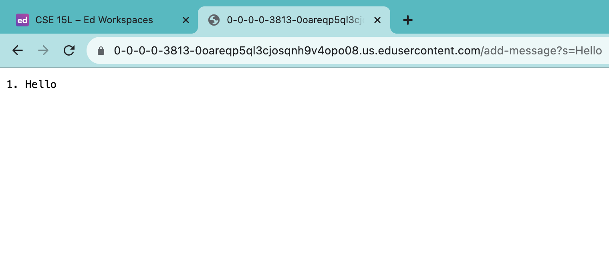
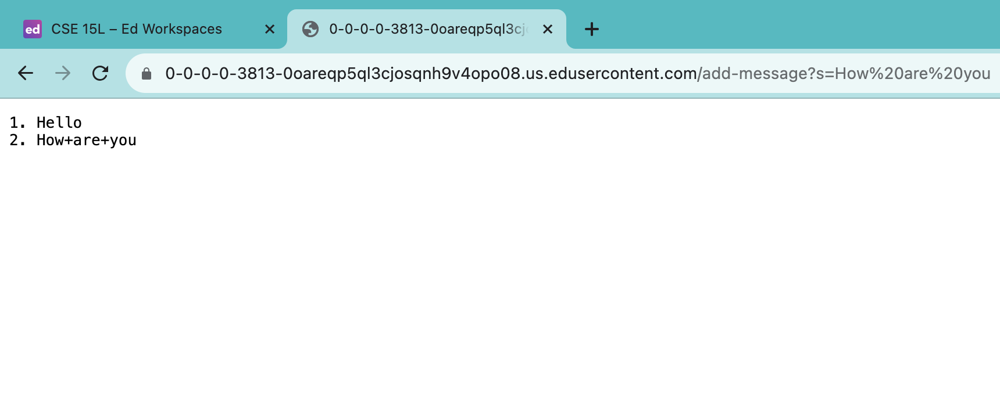

# Lab Report 2 - Servers and SSH Keys

## Part 1
* **Code for `StringServer`**
  ```
  import java.io.IOException;
  import java.net.URI;
  import java.util.*;
  
  class Handler implements URLHandler {
      // The one bit of state on the server: a number that will be manipulated by
      // various requests.
      List<String> list = new ArrayList<String>();
      int count = 0;
  
      public String handleRequest(URI url) {
          if (url.getPath().equals("/")) {
              StringBuilder sb = new StringBuilder();
              for (int k=0; k < list.size(); k++) {
                  sb.append(list.get(k) + "\n");
              }
              return "Jin's strings:" + "\n" + sb.toString();
  
          } else if (url.getPath().contains("/add-message")) {
              StringBuilder sb2 = new StringBuilder();
              String[] parameters = url.getQuery().split("=");
              count += 1;
              list.add(count + ". " + parameters[1]);
              for (int k=0; k < list.size(); k++) {
                  sb2.append(list.get(k) + "\n");
              }
              return sb2.toString() + "\n";
          } else {
              return "404 Not Found!";
              
          }
      }
  }
  
  class StringServer {
      public static void main(String[] args) throws IOException {
          if(args.length == 0){
              System.out.println("Missing port number! Try any number between 1024 to 49151");
              return;
          }
  
          int port = Integer.parseInt(args[0]);
  
          Server.start(port, new Handler());
      }
  }
  ```
* **Add Hello**
  
* **Add How are you**
  

  ```
  [user@sahara ~]$ pwd
  /home
  [user@sahara ~]$ cd
  [user@sahara ~]$ pwd
  /home
  ``` 
  As shown by the `~` sign and `pwd` command, *the initial working directory is `/home` for this and all other examples for question 1.* The command `cd` changes the working directory to an argument; however, there is no change in this situation because no arguments(/directories) are provided to access. Hence, as illustrated by the execution of the second `pwd` command, the present working directory is still `/home` after running the code. - This is not an error.
  <br>
  If the present working directory was not the home directory, `lecture1` and `messages` for instance:
  ```
  [user@sahara ~/lecture1]$ cd
  [user@sahara ~]$ pwd
  /home
  ```
  ```
  [user@sahara ~/messages]$ cd
  [user@sahara ~]$ pwd
  /home
  ```
  Having the `cd` command without any arguments will always bring us back to the home directory. - This is not an error.

<br>
