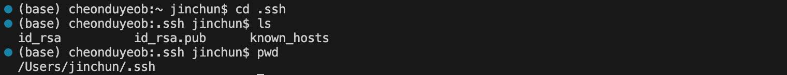
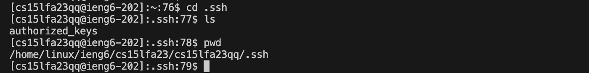
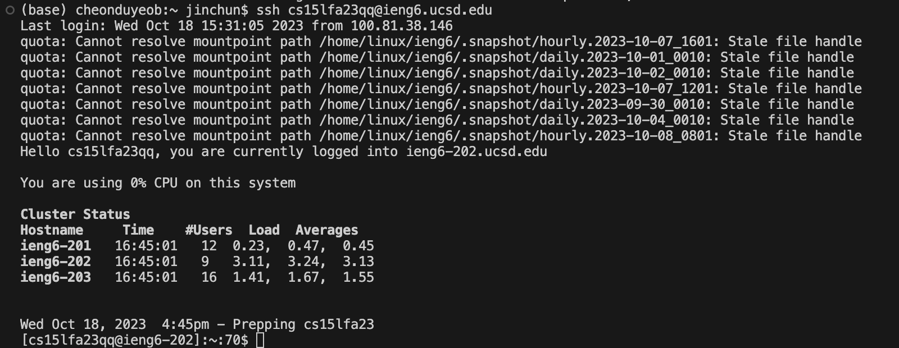

# Lab Report 2 - Servers and SSH Keys

## Part 1
* **Code for `StringServer`**
  ```
  import java.io.IOException;
  import java.net.URI;
  import java.util.*;
  
  class Handler implements URLHandler {
      // The one bit of state on the server: a number that will be manipulated by
      // various requests.
      List<String> list = new ArrayList<String>();
      int count = 0;
  
      public String handleRequest(URI url) {
          if (url.getPath().equals("/")) {
              StringBuilder sb = new StringBuilder();
              for (int k=0; k < list.size(); k++) {
                  sb.append(list.get(k) + "\n");
              }
              return "Jin's strings:" + "\n" + sb.toString();
  
          } else if (url.getPath().contains("/add-message")) {
              StringBuilder sb2 = new StringBuilder();
              String[] parameters = url.getQuery().split("=");
              count += 1;
              list.add(count + ". " + parameters[1]);
              for (int k=0; k < list.size(); k++) {
                  sb2.append(list.get(k) + "\n");
              }
              return sb2.toString() + "\n";
          } else {
              return "404 Not Found!";
              
          }
      }
  }
  
  class StringServer {
      public static void main(String[] args) throws IOException {
          if(args.length == 0){
              System.out.println("Missing port number! Try any number between 1024 to 49151");
              return;
          }
  
          int port = Integer.parseInt(args[0]);
  
          Server.start(port, new Handler());
      }
  }
  ```
* **Add Hello**
  
  First, the main method of the java file is called as we run StringServer. A new `Handler` is instantiated with a new ArrayList 'list' and an int variable 'count'(=0). Subsequently, the `handleRequest` method is called with the argument URI url, which is the link to the server: *https://0-0-0-0-3813-nooos8ggfqtp7eephbm029j8mk.us.edusercontent.com/*. <br><br>
  After entering `/add-message?s=Hello` to the link, the method `.getPath()` will be called to check if the path is equal to `/` by calling `.equals("/")`. The `.getPath()` method returns the path of the URI. The path is not equal to '/'. Next, the method `.getPath()` will be called again to see if the link contains the path "/add-message" by `.contains("/add-message")`. The `.contains(arg)` method returns a boolean value (true/false) according to whether a String contains the String argument or not. <br><br>
  Because the path contains "/add-messages", the method `.getQuery()` is then called to obtain "?s=Hello" part (query) of the url. The method `.query()` returns the query of the URI. The query is split around "=" and stored in the String array 'parameters' by `.split("=")`; the `.split(arg)` method breaks the String around the argument. Hence, 'Hello' is stored in `parameters[1]`.<br><br>
  Next, count is incremented by 1 and `count + ". " + parameters[1]`(=1. Hello) is added to the list by `.add(count + ". " + parameters[1])`. The `.add(arg)` method adds the argument to the list.<br><br>
  A new StringBuilder sb2 is instantiated, and through the for loop contents of the list is copied to sb2 and returned. As "1. Hello" is the only element, sb2 returns "1. Hello" on the browser. <br><br>
  
* **Add How are you**
  
  What each method does is already described above. Note all variables are newly instantiated/resetted except for `count` and `list`; `count` and `list` belongs to the class `Handler`, where as the other variables belong to the method `handleRequest`. Thus, `count` and `list` are resetted when the server is closed while the others reset every time the url is entered.<br><br>
  After entering `/add-message?s=How are you` after `/add-message?s=Hello`, the methods `.getPath().equals("/")` will be called to check whether the path equals "/". It does not. Next, the methods `.getPath().contains("/add-message")` will be called to check if the path contains "/add-messages". It does. So, `.getQuery().split("=")` is called to store "How are you" to parameters[1].  
<br>

## Part 2
* **The path to the *private key* for your SSH key for logging into `ieng6`**
  
  <br>
* **The path to the *public key* for your SSH key for logging into `ieng6`**
  
  <br>
* **A terminal interaction where you log into `ieng6` with your course-specific account without being asked for a password.**
  
<br>

## Part 3
* **In a couple of sentences, describe something you learned from lab in week 2 or 3 that you didn’t know before.**
