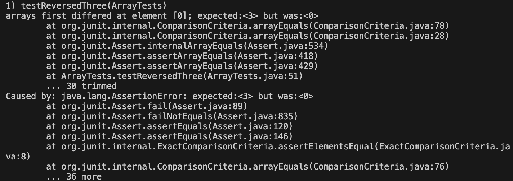
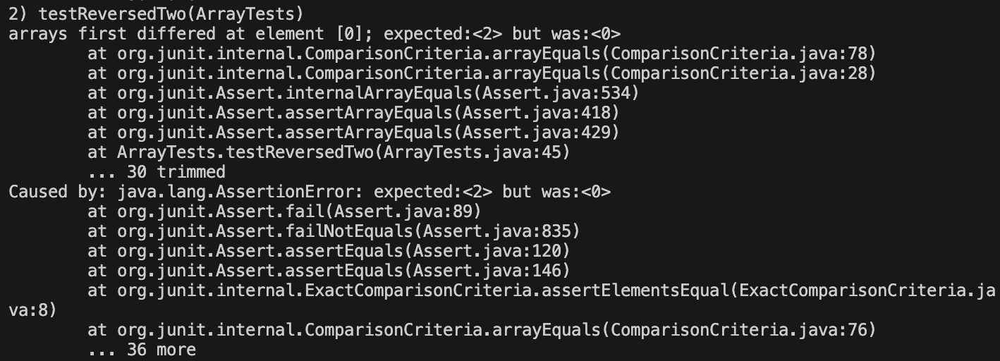
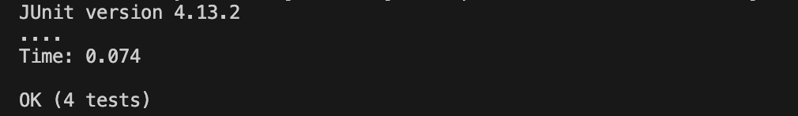
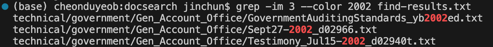
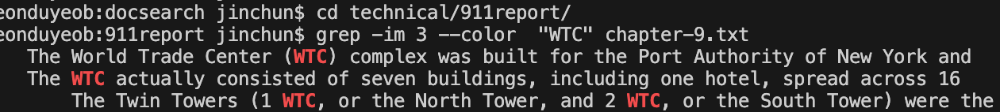
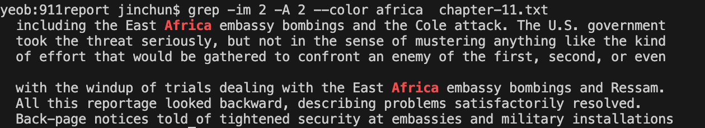

# Lab Report 3 - Bugs and Commands

## Part 1 - Bugs
* **ArrayExamples - reversed**
  ```
  static int[] reversed(int[] arr) {
    int[] newArray = new int[arr.length];
    for(int i = 0; i < arr.length; i += 1) {
      arr[i] = newArray[arr.length - i - 1];
    }
    return arr;
  }
  ```
* **Failure inducing inputs**
  <br><br>
  { 1, 2 }
  ```
  @Test
  public void testReversedTwo() {
    int[] input1 = { 1, 2 };
    assertArrayEquals(new int[]{ 2, 1 }, ArrayExamples.reversed(input1));
  }
  ```
  { 1, 2, 3 }
  ```
  @Test
  public void testReversedThree() {
    int[] input1 = { 1, 2, 3 };
    assertArrayEquals(new int[]{ 3, 2, 1 }, ArrayExamples.reversed(input1));
  }
  ```

  { 1, 2, 3, 4 }
  ```
  @Test
  public void testReversedFour() {
    int[] input1 = { 1, 2, 3, 4 };
    assertArrayEquals(new int[]{ 4, 3, 2, 1 }, ArrayExamples.reversed(input1));
  }
  ```

  <br>
* **An input that doesn’t induce a failure**
  <br><br>
  { }
  ```
  @Test
  public void testReversed() {
    int[] input1 = { };
    assertArrayEquals(new int[]{ }, ArrayExamples.reversed(input1));
  }
  ```
  
  <br>
* **The symptom, as the output of running the tests**
  
  *Symptom*: arrays first differed at element [0]; expected:<3> but was:<0>
  <br><br>
  
  *Symptom*: arrays first differed at element [0]; expected:<2> but was:<0>
  <br><br>
  
  *Symptom*: arrays first differed at element [0]; expected:<4> but was:<0>
  
  <br>
* **The bug, as the before-and-after code change required to fix it**
  ```
  static int[] reversed(int[] arr) {
    int[] newArray = new int[arr.length];
    for(int i = 0; i < arr.length; i += 1) {
      newArray[i] = arr[arr.length - i - 1];
    }
    return newArray;
  }
  ```
  
  Code before the fix was assigning ```newArray[arr.length - i - 1]``` to ```arr[i]```. As initialized in the above line ```int[] newArray = new int[arr.length];```, newArray is an empty array; copying it to the original array and returning the new array would not mean anything. It would just change the original array to an empty array, and return an empty array (where all values are initialized to 0) every time. By swapping the assignment - ```newArray[i] = arr[arr.length - i - 1];``` - the code will successfully copy the original content of the array to the new array (to be returned) in a reversed order.
  <br><br>

## Part 2 - Researching Commands
*ALL option/modes are found from the ``man`` command, along with the descriptions. <br>
The file ```find-results.txt``` is created by the command ```find technical -name "*.txt" > find-results.txt``` in terminal for demonstration. <br>
The starting working directory is ```DOCSEARCH```(parent of ```technical```) for all examples.*
<br>
* **grep -m num**
  <br>
  --max-count=num: Stop reading the file after num matches.
  ```
  $ grep -im 5 legal find-results.txt
  technical/government/About_LSC/LegalServCorp_v_VelazquezSyllabus.txt
  technical/government/About_LSC/LegalServCorp_v_VelazquezDissent.txt
  technical/government/About_LSC/ONTARIO_LEGAL_AID_SERIES.txt
  technical/government/About_LSC/LegalServCorp_v_VelazquezOpinion.txt
  technical/government/Media/Legal-aid_chief.txt
  ```
  The above code searches for the first 5 text files in ```find-results.txt``` that includes 'legal' in their name (or path), case insensitive(-i).
  <br><br>
  ```
  $ cd technical/911report/
  $ grep -im 3 "United States" chapter-5.txt
            By early 1999, al Qaeda was already a potent adversary of the United States. Bin
                activities while in the United States, KSM plunged into the anti-Soviet Afghan jihad
                Yousef 's intention to launch an attack inside the United States in 1991 or 1992,
  ```
  Here, the above code searches for the first 3 lines in ```technical/911report/chapter-5.txt``` that includes 'United States'.
  <br><br>
  As shown by the examples, the ```-m``` option in ```grep``` allows you to access the first ```num``` matches of ```grep```. This would be useful in cases where you want the log to be saved/shown in terminal - it is only viewable a single time in ```less```. It is also an advantage that the user can choose the number of lines to fetch. Nonetheless, having a restricted number of matches to return will significantly reduce the processing time given the user is only interested in the first ```num``` results; disregarding the unnecessary results.
  
  <br>
* **grep --color**
  <br>
  Mark up the matching text with the expression stored in the GREP_COLOR environment variable. 
  ```
  $ grep -im 3 --color 2002 find-results.txt
  technical/government/Gen_Account_Office/GovernmentAuditingStandards_yb2002ed.txt
  technical/government/Gen_Account_Office/Sept27-2002_d02966.txt
  technical/government/Gen_Account_Office/Testimony_Jul15-2002_d02940t.txt
  ```
  
  The above code searches for the first 3 text files(-m) in ```find-results.txt``` that includes '2002' in their name (or path), case insensitive(-i), and highlights the match in a color.
  <br><br>
  ```
  $ cd technical/911report/
  $ grep -im 3 --color  "WTC" chapter-9.txt
            The World Trade Center (WTC) complex was built for the Port Authority of New York and
            The WTC actually consisted of seven buildings, including one hotel, spread across 16
                The Twin Towers (1 WTC, or the North Tower, and 2 WTC, or the South Tower) were the
  ```
  
  Here, the above code searches for the first 3(-m) lines in ```technical/911report/chapter-9.txt``` that includes 'WTC', and highlights in a color.
  <br><br>
  As shown by the examples, the ```--color``` option in ```grep``` identifies the lines that include a certain text (grep) and highlights the matching text in the output. This will make it easier for the user to identify where the searched text is in the output.
  
  <br>
* **grep -A**
  <br>
  --after-context=num: Print num lines of trailing context after each match.
  ```
  $ grep -im 3 -A 2 lawyer find-results.txt
  technical/government/Media/Philly_Lawyers.txt
  technical/government/Media/Too_Crucial_to_Take_Cut.txt
  technical/government/Media/Pro_Bono_Services.txt
  --
  technical/government/Media/Texas_Lawyer.txt
  technical/government/Media/Disaster_center.txt
  technical/government/Media/Kiosks_for_court_forms.txt
  --
  technical/government/Media/Poverty_Lawyers.txt
  technical/government/Media/Wingates_winds.txt
  technical/government/Media/Avoids_Budget_Cut.txt
  ```
  The above code searches for the first 3 results(-m) of ```grep```. ```grep``` searches for the text files in ```find-results.txt``` that includes 'lawyer' in their name (or path), case insensitive(-i), and the ```-A``` option prints 2 lines trailing after the ```grep``` match. For instance, for the first match, ```technical/government/Media/Too_Crucial_to_Take_Cut.txt``` and ```technical/government/Media/Pro_Bono_Services.txt``` are the 2 lines after the match ```technical/government/Media/Philly_Lawyers.txt```.
  <br><br>
  ```
  $ cd technical/911report/
  $ grep -im 2 -A 2 --color africa  chapter-11.txt
                including the East Africa embassy bombings and the Cole attack. The U.S. government
                took the threat seriously, but not in the sense of mustering anything like the kind
                of effort that would be gathered to confront an enemy of the first, second, or even
  --
                with the windup of trials dealing with the East Africa embassy bombings and Ressam.
                All this reportage looked backward, describing problems satisfactorily resolved.
                Back-page notices told of tightened security at embassies and military installations
  ```
  
  Here, the above code searches for the first 2(-m) lines in ```technical/911report/chapter-11.txt``` that includes 'africa', case insensitive(-i), and highlights it in a color. The ```-A``` 2 option prints the 2 lines following each ```-grep``` match.
  <br><br>
  As shown by the examples, the ```-A``` command prints the ```num``` trailing lines after each match. This would be useful when the user wants to know the context of the output (particularly relevant for text files similar to the second example.)
  Along with the ```-A``` option, there are ```-B``` and ```-C``` options that also helps the user to understand the context of the match more easily; ```-B``` prints the ```num``` of lines before the match and ```-C``` prints the ```num``` of lines before and after the match (-A + -B).

  <br>
* **grep -c**
  <br>
  --count: Only a count of selected lines is written to standard output.
  ```
  $ grep -c .txt find-results.txt
  1391
  ```
  The above code counts the number of .txt files in ```find-results.txt```. 
  <br><br>
  ```
  $ grep -c report find-results.txt
  22
  ```
  The above code counts the number of .txt files that includes the name 'report' in its name (or path) in ```find-results.txt```. 
  <br><br>
  As shown by the examples, the ```-c``` command makes the process of counting number of lines more efficiently than having to use ```grep``` then ```wc```. For the first example, the same result was obtained in the lab by ```grep ".txt" find-results.txt > grep-results.txt```, ```wc grep-results.txt```, which are 2 lines. Using the ```-c``` option, this can be done within grep - a single line.
  
<br><br>
