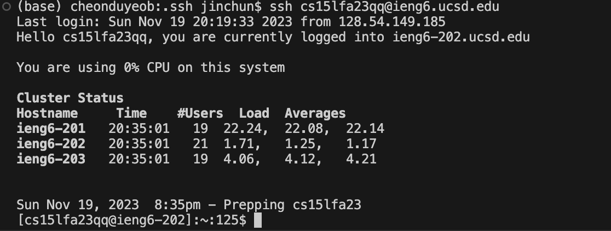

# Lab Report 4 - Vim

* **Log into ieng6**
  
  
* **Clone your fork of the repository from your Github account (using the SSH URL)**
  

* **Run the tests, demonstrating that they fail**
  
  
* **Edit the code file to fix the failing test**
  ```vim ListExamples.java```
  
  pressed keys: ```14+j+<enter>+e+r+2+:+w+q+<enter>```
  

* **Run the tests, demonstrating that they now succeed**
  
  
* **Commit and push the resulting change to your Github account**
  
