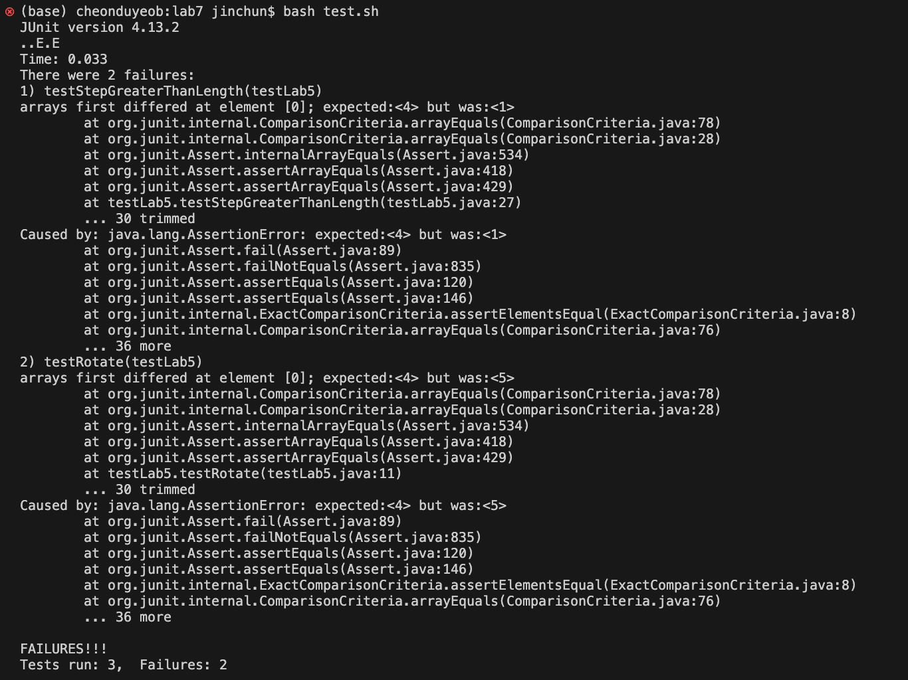
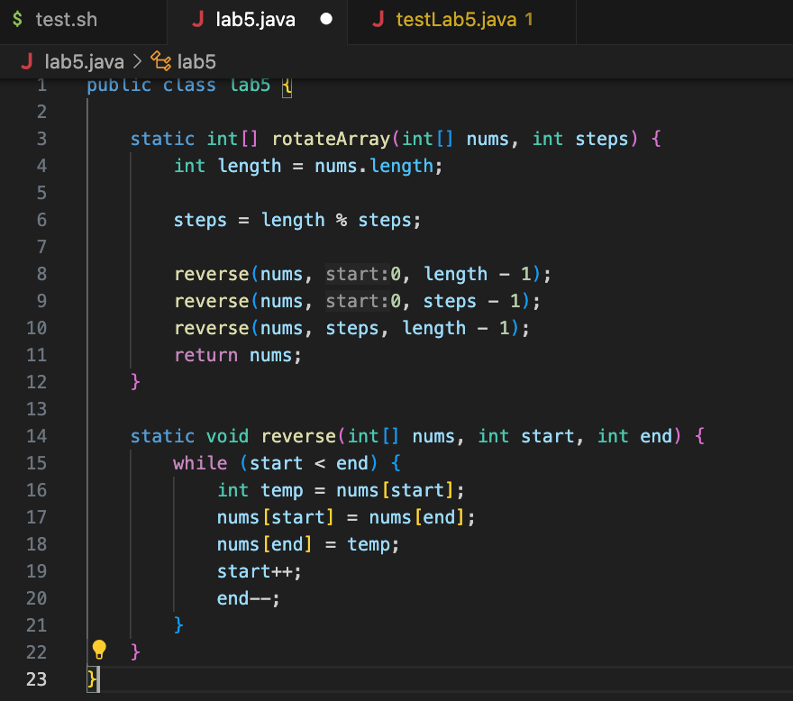
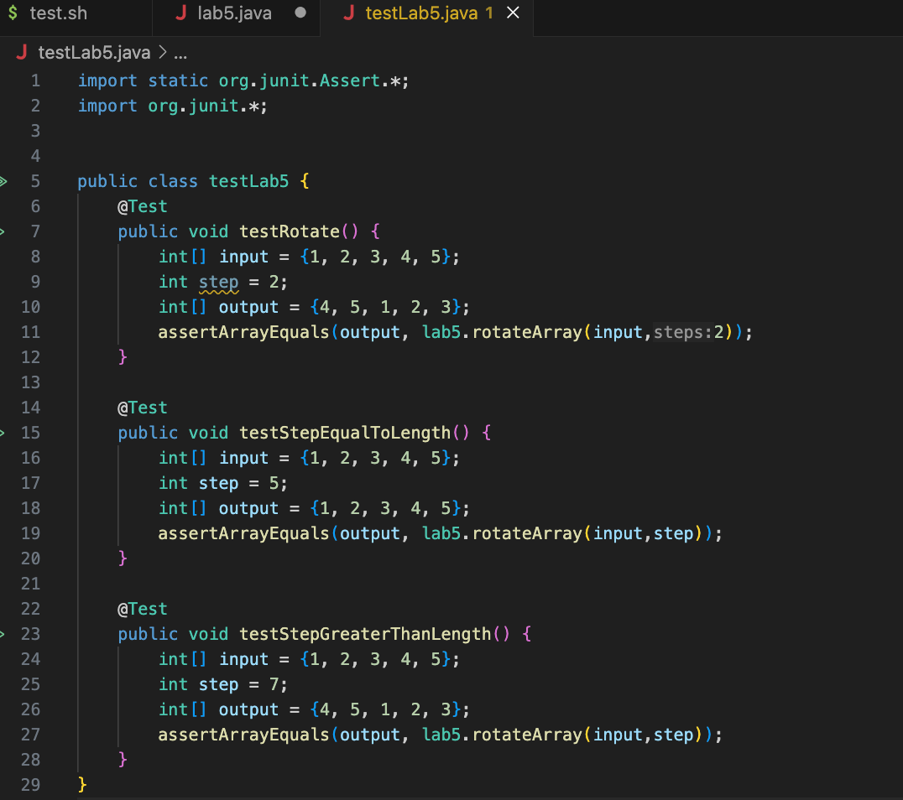
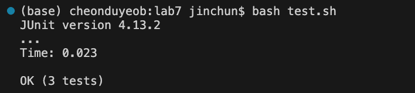

# Lab Report 5 - Putting it All Together

## Part 1 - Debugging Scenario
* **Original post from student**
<br><br>

My code to rotate arrays (shifts an array by integer numbers) doesn't work for numbers greater than or less than the length. I get different answers as the symptom. My codes for the algorithm and tests are as follows:
<br><br>
<br><br>

* **Response from TA**
<br><br>
Try to revisit the logic for your ```steps```. 
<br><br>
* **Student's fix**
<br><br>
I have changed ```steps = length % steps;``` to ```steps = steps % length;```. The buggy algorithm was shifting the arrays by the wrong index.
The tests work now. Thank you!
<br>
<br><br>
* **Information**
<br><br>
**lab5.java**
```
public class lab5 {

    static int[] rotateArray(int[] nums, int steps) {
        int length = nums.length;

        steps = length % steps;

        reverse(nums, 0, length - 1);
        reverse(nums, 0, steps - 1);
        reverse(nums, steps, length - 1);
        return nums;
    }

    static void reverse(int[] nums, int start, int end) {
        while (start < end) {
            int temp = nums[start];
            nums[start] = nums[end];
            nums[end] = temp;
            start++;
            end--;
        }
    }
}
```
<br><br>
**testLab5.java**

```
import static org.junit.Assert.*;
import org.junit.*;


public class testLab5 {
	@Test
	public void testRotate() {
    	int[] input = {1, 2, 3, 4, 5};
        int step = 2;
        int[] output = {4, 5, 1, 2, 3};
		assertArrayEquals(output, lab5.rotateArray(input,2));
	}

    @Test
	public void testStepEqualToLength() {
    	int[] input = {1, 2, 3, 4, 5};
        int step = 5;
        int[] output = {1, 2, 3, 4, 5};
		assertArrayEquals(output, lab5.rotateArray(input,step));
	}

    @Test
	public void testStepGreaterThanLength() {
    	int[] input = {1, 2, 3, 4, 5};
        int step = 7;
        int[] output = {4, 5, 1, 2, 3};
		assertArrayEquals(output, lab5.rotateArray(input,step));
	}
}
```

<br><br>
**test.sh**
```
javac -cp .:lib/hamcrest-core-1.3.jar:lib/junit-4.13.2.jar *.java
java -cp .:lib/hamcrest-core-1.3.jar:lib/junit-4.13.2.jar org.junit.runner.JUnitCore testLab5
```
<br><br>
They all need to be in the same directory along with ```lib``` (with the .jar files). Commands ran were just ```bash test.sh```, since the tests were all inside the test file. To fix the edit, ```steps = length % steps;``` was changed to ```steps = steps % length;```, because they return the different outputs, and what I intended was the latter - to wrap around the length. 
<br><br>
## Part 2 - Reflection
<br>
During the lab session I could learn some practical skills, such as how to utilize github, that I know will help me in my future careers. Vim was something new for the second half of the session.
